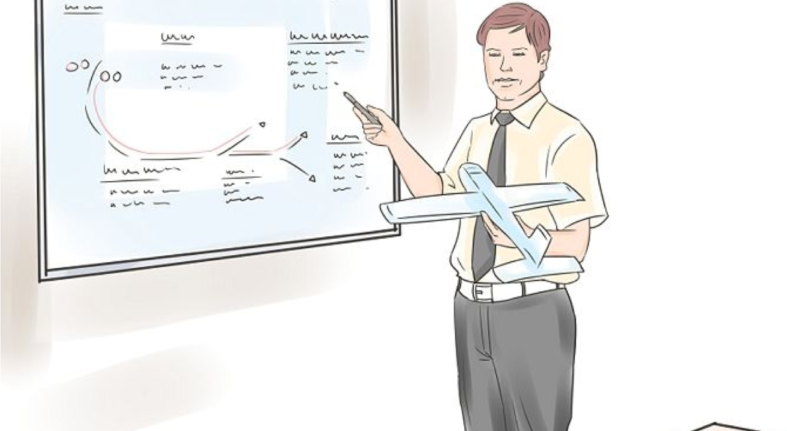
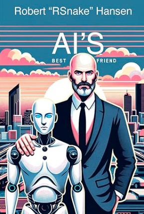
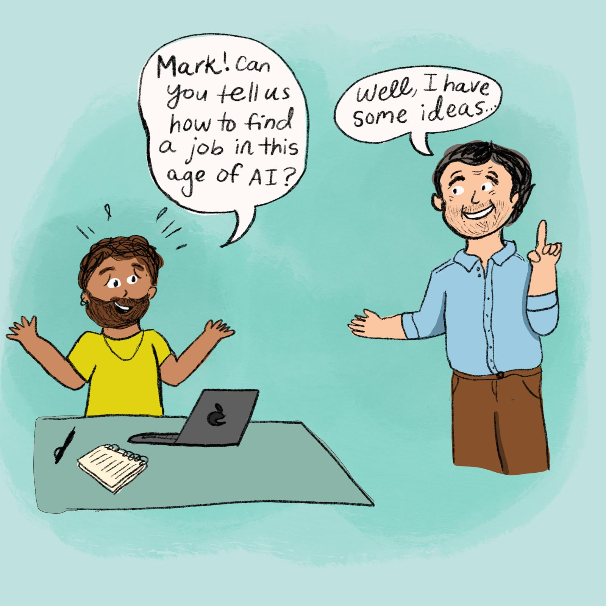

# Prompt Engineering for Business Professionals

Elephant Scale

---

## Pre-requisites and Expectations

* Comfort using a web browser and everyday office software

* **No coding required** — and none will sneak in

  - Everything happens in the browser
  - Bring your account, or use the one we provide in class

* Curiosity!

  - Ask a lot of questions

* This is a "Prompt Engineering for Business Professionals" class
  - No previous AI experience is assumed (but may be helpful)
  - Class will be based on the pace of the majority of the students

Notes:

---
## Our Teaching Philosophy

* Emphasis on concepts & fundamentals

* Browser tools - no need to learn anything by heart

* Highly interactive (questions and discussions are welcome)

* Hands-on (learn by doing)

Notes:

---

## Lots of Labs: Learn By Doing

* Where is the ANY key?

 <!-- {"left" : 1.37, "top" : 2.26, "height" : 5.65, "width" : 7.51} -->

Notes:

---

## Analogy: Learning To Fly...

 <!-- {"left" : 0.66, "top" : 2.06, "height" : 4.89, "width" : 8.93} -->

---

## Introductions

 <!-- {"left" : 0.6, "top" : 2.06, "height" : 4.96, "width" : 9.04} -->

Notes:

---

## + Flight Time

 <!-- {"left" : 0.61, "top" : 2.06, "height" : 4.95, "width" : 9.04} -->

---

## This Will Take A Lot Of Practice

 <!-- {"left" : 0.69, "top" : 2.06, "height" : 5.63, "width" : 8.87} -->

---
## About You And Me

* About Instructor
* About you
  - Your Name
  - Your role (sales, marketing, analyst, ops, manager, ...)
  - Tasks you'd love to write a better prompt for
  - Familiarity with AI so far (scale of 1 - 4 ;  1 - new,   4 - I use it daily)
  - Something non-technical about you! (favorite ice cream flavor / hobby...)

 &nbsp; <!-- {"left" : 1.08, "top" : 6.08, "height" : 1.99, "width" : 2.25} --> &nbsp; <!-- {"left" : 3.36, "top" : 6.1, "height" : 1.92, "width" : 3.54} --> &nbsp; <!-- {"left" : 6.92, "top" : 6.08, "height" : 1.99, "width" : 2.25} -->

# The Highest-Leverage Skill of the Decade

---

## Andrew Ng on AI

* Myth: getting value from AI needs engineers and budgets.
* True: *training* frontier models is expensive.
* But *using* AI is now cheap — often free — right from a browser. The differentiator is **how you ask**.

Notes:
Source: https://www.deeplearning.ai/the-batch/falling-llm-token-prices-and-what-they-mean-for-ai-companies/

---

## Sam Altman on AI apps
* _"While big companies often operate on extended planning cycles—sometimes spanning years or even decades—startups can swiftly adapt to technological changes."_

---

## Why is this class different
* Before
  * We taught AI tools you had to code against
  * Students enjoyed the show but did not become power users
* Now
  * We teach **prompt engineering** — the craft of instructing AI clearly
  * Same assistant, dramatically better results — no code required

---

# AI Will Not Take My Job

---

## What will happen instead?
* AI will become your friend
* You will become AI's friend — and the person who can **direct** it well is the one who gets ahead

---

## Andrew Ng
* Andrew Ng is a founder of Coursera
* Honorary doctor at Exeter
* Much material is based on his letter about the event

---

## Andrew Ng at University of Exeter Faculty of Environment, Science and Economy.
* A forward-looking way to organize an academic division.
* Computer Science alongside Environmental Science and the Business School.
* Natural collaboration across the fields.

---

## Future

* Every organization must become an AI organization.
* Not just *building* AI — *using* it to advance every kind of work.
* Not abandoning your expertise — keeping your judgment while AI enhances the work.
* A good prompt is how your judgment reaches the model.

---

## Yes, you will have to learn

* The AI will be your helper on the way
* DIY
  * [AI for Everyone](https://www.coursera.org/learn/generative-ai-for-everyone)
  * [Elephant Scale Webinar](https://courses.elephantscale.com/pages/advances-in-ai-free-weekly-webinar)
* For your company
  * https://elephantscale.com/
  * info@elephantscale.com

---

## The Two-Day Map

| Day | Modules | You go from... |
|-----|---------|----------------|
| 1 | 1 — How Modern AI Assistants Work | a mental model of how the model behaves |
| 1 | 2 — The Anatomy of a Strong Prompt | building prompts from six blocks, not guesswork |
| 1 | 3 — Prompting for Real Business Scenarios | on-brand marketing, sales, support & ops output |
| 2 | 4 — Advanced Techniques | reasoning, prompt chains, grounding in your docs |
| 2 | 5 — Refining, Testing & Evaluating | scoring prompt quality instead of guessing |
| 2 | 6 — Building & Governing Prompt Systems | a reusable, versioned team prompt library |
| 2 | 7 — Capstone | a working AI solution for your own work + a plan |

In every module you build a real artifact you can take back to work.

---

## Ground Rules

* Use **classroom-approved accounts and data** only.
* **Do not upload confidential information** unless the environment is explicitly approved for it.
* **Verify important facts** before you act on them — the model can be confidently wrong.
* Keep a **human approval step** in any workflow that sends, publishes, deletes, or buys.

Notes:
These four habits separate a useful AI habit from an expensive mistake. We make them second nature starting with Lab 01.
